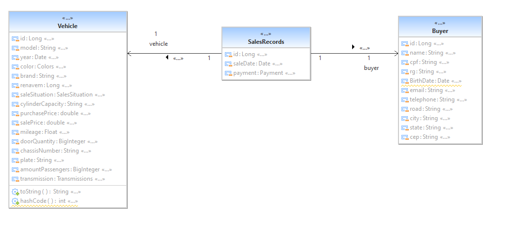

# Autotrade
Autotrade é projeto desenvolvido no curso +devs2Blu.
É um sistema backend feito em java com o framework Spring, que tem como objetivo gerenciar uma revendedora de carro.
## Diagrama de Classe 
    
 

# Requisitos Funcionais
## Buyer
- Cadastrar
  - Apenas 1 por Api
-  Excluir
-    - Apenas 1 por Api
- Atualizar cadastro
  - Apenas 1 por Api
- Listar Clientes
- Pesquisar um único  cliente pelo ID.

## Vehicle
- Cadastrar
  - Apenas 1 por Api
-  Excluir
-    - Apenas 1 por Api
- Atualizar cadastro
  - Apenas 1 por Api
- Listar Veiculos
- Pesquisar um único  Veiculos pelo ID.
- 
## SalesRecords(Registro de Venda)
- Cadastrar
  - Apenas 1 por Api
-  Excluir
-    - Apenas 1 por Api
- Atualizar cadastro
  - Apenas 1 por Api
- Listar todas as vendas
- Pesquisar uma único  vendas pelo ID.
  
## Requisitos Não Funcionais
- JDK (Java Development Kit)
- Spring Tool Suite 4
- Framework
  - Spring boot
  - Hibernate
  - Lombok
  - Jacoco
  - JUnit
  - JPA 
- Testes Unitarios com 50% de cobertura.
- Gerenciador de banco de dados Postgre.
- Documentação das API’s no Swagger.

# Regras de Negócio
- Todos os campos são obrigatorios 
- Renavam, CPF, RG são unicos.
